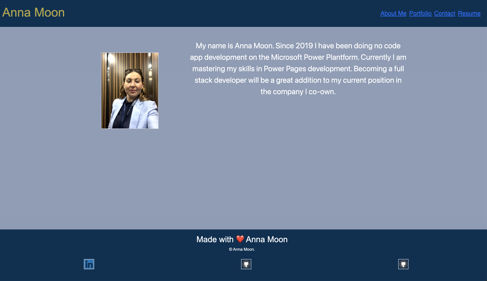
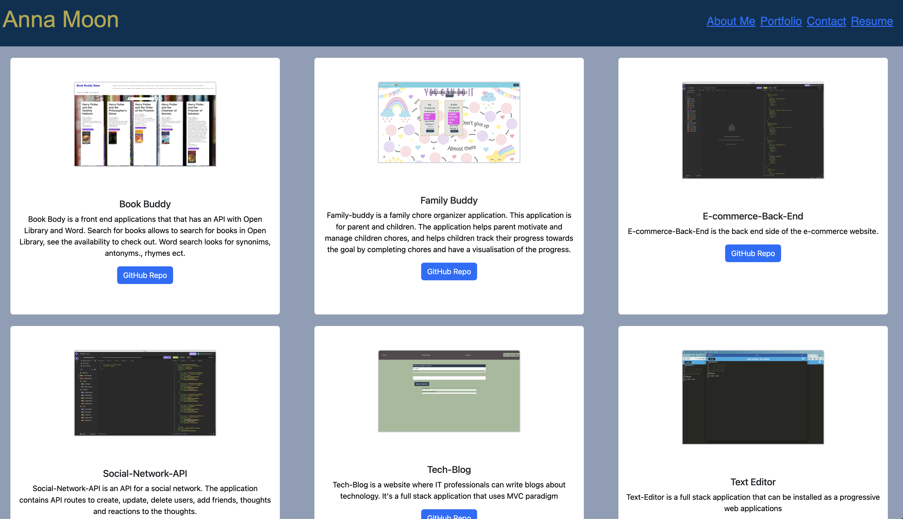
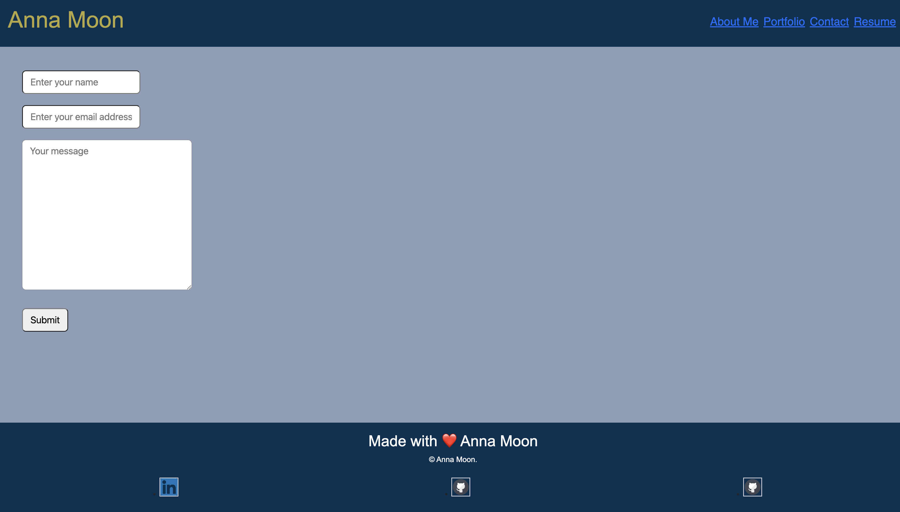
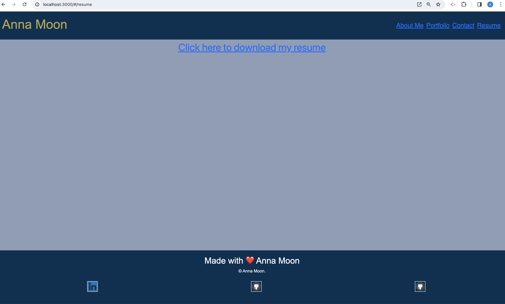

# React-Portfolio

## Description
     
* React-Portfolio is a single page application built with the use of React Library.  

* _What motivated me to do this project? I wanted to learn more about React. 

* _Why did I build this application?_ As a young developer it is important for me to master my skills in building application using React.

* _What did I learn?_  I learned how to build single page application using React. 
      

## Table of Contents
    
1. [Installation](#installation)
1. [Usage](#usage)
1. [License](#license)
1. [Contributing](#contributing)
1. [Tests](#tests)
1. [Questions](#questions)

## Installation
Run npm start dev to open at local host 3000. 

## Usage
Run npm start dev to open at local host 3000.  
## License
None
## Contributing
n/a
## Tests
Run npm start dev to open at local host 3000. 
## Questions
You can see my GitHub accounts here:
>[Anna](https://github.com/Four-Moons-Tech/React-Portfolio)

>You can contact us via email with any questions:
>Anna:  anna@fourmoonstech.com

>
>
>
>
